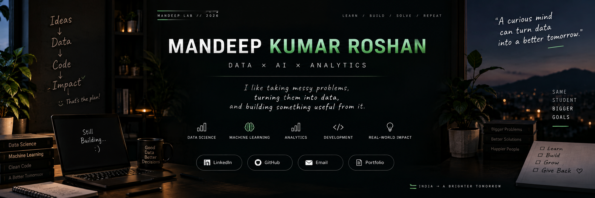

<div align="center">



<br />

### `MANDEEP LAB // 2026`

**DATA&nbsp; ×&nbsp; AI&nbsp; ×&nbsp; ANALYTICS&nbsp; ×&nbsp; SOFTWARE**

<samp>Mandeep Kumar Roshan &nbsp;·&nbsp; B.Tech CSE &nbsp;·&nbsp; Data Science / AI-ML</samp>

<br />

> Most of what I build starts with a dataset I don't understand yet.
> I clean it, argue with it, model it, and stop when it can answer something useful.

<br />

<a href="https://www.linkedin.com/in/mandeep-roshan/">
  
</a>
&nbsp;
<a href="mailto:mandeepekta443@gmail.com">
  
</a>

</div>

---

## `01` &nbsp; About

I'm a B.Tech Computer Science student working my way through data science, machine learning and analytics — mostly by building things and seeing where they break.

What I enjoy is the part before the model: figuring out what the data actually says, which features matter, and whether the answer is worth trusting. The model is just the last step. After that I try to put the result somewhere a person can use it — a Streamlit app, a Power BI dashboard, a notebook someone else can follow.

Right now I'm spending time on time-series forecasting, recommendation systems and dashboards that hold up to questions.

---

## `02` &nbsp; Current focus

<div align="center">

| Data Science | Machine Learning | Analytics &amp; BI | Building |
|:---:|:---:|:---:|:---:|
| Cleaning, EDA,<br />feature engineering | Regression, classification,<br />clustering, forecasting | Power BI dashboards,<br />DAX, Power Query | Streamlit apps,<br />Python tools |

</div>

---

## `03` &nbsp; Things I've built

<div align="center">
<table>
<tr>
<td width="50%" valign="top">

### AniWise

Content-based anime recommender. Encodes genres, themes, studios and demographics into features, then finds similar titles with KNN and cosine distance. Ships with a Streamlit app for search and a Power BI dashboard for the analytics side.

`Python` `Scikit-learn` `Streamlit` `Power BI`

[Repository](https://github.com/Mandeep2807/AniWise-AI-Powered-Anime-Recommendation-System) &nbsp;·&nbsp; [Live app](https://aniwise-ai-powered-anime-recommendation-system-lrpc5mtmxkwsiho.streamlit.app/)

</td>
<td width="50%" valign="top">

### Sales Forecasting &amp; Demand Intelligence

An end-to-end retail dashboard: KPIs and trends, category and region forecasts, anomaly flags, and demand segments. SARIMA, Prophet and XGBoost are compared for the forecast; Isolation Forest handles anomalies, K-Means the segmentation.

`Python` `Streamlit` `SARIMA` `XGBoost` `Scikit-learn`

[Repository](https://github.com/Mandeep2807/Sales-Forecasting-Demand-Intelligence-System) &nbsp;·&nbsp; [Live app](https://sales-forecasting-demand-intelligence-system-pzrq4j8n7nxvcbfsd.streamlit.app/)

</td>
</tr>
<tr>
<td width="50%" valign="top">

### NIFTY-50 Prediction &amp; EDA

Historical NIFTY-50 trading data taken from cleaning and exploratory analysis through feature engineering — year, month, daily price change — and then used to compare Linear Regression against a Decision Tree Regressor on closing prices.

`Python` `Pandas` `Scikit-learn` `Matplotlib` `Seaborn`

[Repository](https://github.com/Mandeep2807/NIFTY50-ML-Prediction-EDA)

</td>
<td width="50%" valign="top">

### Employee Attrition Prediction

IBM HR analytics data — 1,470 employees, 35 attributes — used to work out who is likely to leave and why. Logistic Regression, Random Forest and Gradient Boosting are compared, and the findings are written up as retention suggestions rather than just scores.

`Python` `Scikit-learn` `Pandas` `Seaborn`

[Repository](https://github.com/Mandeep2807/Employee-Attrition-Prediction)

</td>
</tr>
<tr>
<td width="50%" valign="top">

### Olympics Performance Dashboard

120 years of Olympic results (1896–2016) reshaped in Power Query and built into an interactive Power BI report: participation trends, medal distribution, country performance and gender participation, with DAX measures behind the KPI cards.

`Power BI` `Power Query` `DAX`

[Repository](https://github.com/Mandeep2807/olympics-performance-analysis-powerbi) &nbsp;·&nbsp; [Write-up](https://www.linkedin.com/posts/mandeep-roshan_powerbi-dataanalytics-datascience-ugcPost-7453095473088712704-m2T7)

</td>
<td width="50%" valign="top">

### House Price Prediction

Predicting house prices from property attributes such as area, bathrooms, parking and furnishing. Linear Regression against Random Forest, scored with MAE, RMSE and R², plus a look at which features actually move the price.

`Python` `Scikit-learn` `Pandas` `Matplotlib`

[Repository](https://github.com/Mandeep2807/House-Price-Prediction)

</td>
</tr>
<tr>
<td width="50%" valign="top">

### Page Replacement Simulator

A step away from data work: a Tkinter desktop app that runs FIFO, LRU and Optimal on the same reference string, so you can watch where the page faults happen instead of taking the textbook's word for it.

`Python` `Tkinter` `Operating Systems`

[Repository](https://github.com/Mandeep2807/Efficient-Page-Replacement-Simulator)

</td>
<td width="50%" valign="top">

### Everything else

Datasets I'm still poking at, notebooks that haven't earned a repository yet, and the occasional idea that didn't survive contact with real data.

`work in progress`

[All repositories](https://github.com/Mandeep2807?tab=repositories)

</td>
</tr>
</table>
</div>

---

## `04` &nbsp; Tools I actually use

<table>
<tr>
<td valign="top"><b>Languages</b></td>
<td><code>Python</code> &nbsp; <code>Jupyter Notebook</code></td>
</tr>
<tr>
<td valign="top"><b>Data &amp; ML</b></td>
<td><code>Pandas</code> &nbsp; <code>NumPy</code> &nbsp; <code>Scikit-learn</code> &nbsp; <code>SciPy</code> &nbsp; <code>Statsmodels</code> &nbsp; <code>XGBoost</code> &nbsp; <code>Prophet</code></td>
</tr>
<tr>
<td valign="top"><b>Visualization &amp; BI</b></td>
<td><code>Matplotlib</code> &nbsp; <code>Seaborn</code> &nbsp; <code>Plotly</code> &nbsp; <code>Power BI</code> &nbsp; <code>Power Query</code> &nbsp; <code>DAX</code></td>
</tr>
<tr>
<td valign="top"><b>Building &amp; shipping</b></td>
<td><code>Streamlit</code> &nbsp; <code>Tkinter</code> &nbsp; <code>Git</code> &nbsp; <code>GitHub</code></td>
</tr>
</table>

---

## `05` &nbsp; The lab, in numbers

<div align="center">


<br /><br />


</div>

---

## `06` &nbsp; How a project usually goes

```text
a question I can't answer  →  find the data  →  spend longer cleaning it than expected
                           →  build something small  →  break it  →  fix it
                           →  ship it where someone can click on it  →  find a better question
```

I'm not pretending to be an expert at any of this. Each project teaches me one thing I got wrong in the last one — a leaky feature, a metric that flattered the model, a dashboard nobody could read. That's the whole point of keeping them public.

---

## `07` &nbsp; Connect

<div align="center">

[LinkedIn](https://www.linkedin.com/in/mandeep-roshan/) &nbsp;·&nbsp; [Email](mailto:mandeepekta443@gmail.com) &nbsp;·&nbsp; [GitHub](https://github.com/Mandeep2807)

<sub>Open to data science and analytics internships, and to anyone who wants to talk about a messy dataset.</sub>

</div>

---

<div align="center">

### `ASK → CLEAN → MODEL → SHIP → ASK BETTER`

<sub>The lab is always mid-experiment.</sub>

</div>
